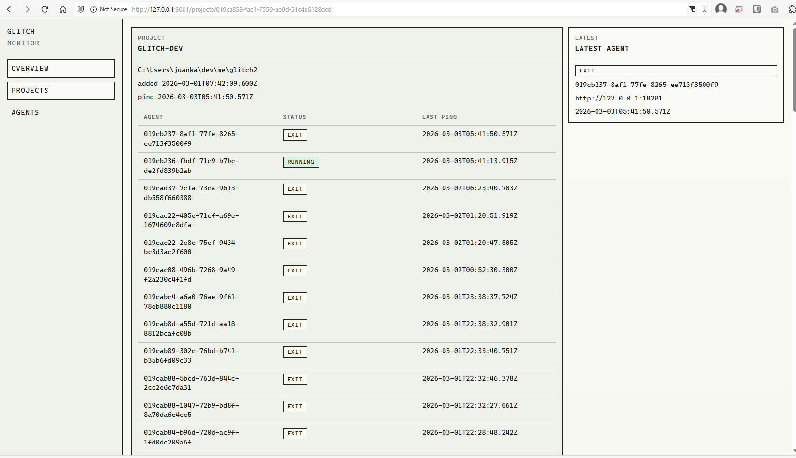

```
|\\\\\\\\\\\\\\\\\\\\\\\\\\\\\\///////////////////////////|
|\\\\\\\///////\\\\\\\/////\\\\\\\///////\\\\\\\//////////|
|\\\\////\\\\////\\\\////\\////\\\\////\\\\////\\\\///////|
|\\\//////\\//////\\////////////\\//////\\//////\\////////|
|////\\\\////\\\\////\\\\//\\\\////\\\\////\\\\////\\\\///|
|///\\\\\\\\///\\\\\\\\///\\\\\\///\\\\\\\\///\\\\\\\\////|
|////////\\\\\\\\////////\\\\\\////////\\\\\\\\///////////|
|//////////////////////////\\\\\\\\\\\\\\\\\\\\\\\\\\\\\\\|
```

# Glitch

Glitch is a local developer tool that gives developers a single pane of glass for local development.

It is designed to help you run local processes and inspect everything they produce in one place: logs, errors, requests, events, and, over time, metrics and database access.



## Overview

Glitch is split into three runtime components:

- `agent`: a local CLI that runs and supervises project processes, captures monitoring data, and stores it in a local SQLite database.
- `monitor`: a local background host that manages discovery, serves the UI shell, tracks monitor state, and bridges live and historical data for the browser.
- `ui`: a small SolidJS single-page application that talks only to the monitor.

The goal is to reduce context switching during development. Instead of jumping between terminal tabs, browser devtools, log files, and ad hoc tools, Glitch provides one local workspace for understanding what your application is doing.

## Module-Based Design

Glitch is organized around togglable modules enabled through a project config file.

Examples of planned modules:

- `logger`: capture stdout/stderr and expose searchable logs
- `supervision`: supervise local processes and emit lifecycle events for modules
- `requests`: track HTTP requests and responses
- `events`: capture domain or application events
- `metrics`: collect counters, timings, and resource usage
- `database`: inspect local project database access and state

Each module can be enabled or disabled depending on the project and the developer's needs.

## Local-First Architecture

Glitch stores monitoring data in a per-project SQLite database:

- project database: `<projectRoot>/.glitch/agent.glitch`

To make project discovery easy across the machine, Glitch also keeps shared runtime state in the user's home directory:

- global registry: `<home>/.glitch/`

Current shared files include:

- registry database: `<home>/.glitch/registry.glitch`
- monitor lock: `<home>/.glitch/monitor.lock`
- monitor state: `<home>/.glitch/monitor.state.json`

This shared state allows the monitor and UI to find:

- known Glitch-enabled projects
- active agents
- agent connection endpoints
- the current monitor instance
- general Glitch settings

Whenever the agent runs for a project, that project is added to the known-project list in the registry.

## Repository Planning Docs

Feature planning and historical implementation notes live under [`features/`](./features/README.md).

This folder is intended to serve two purposes:

- planning staging ground for new work
- long-term artifact describing how features were designed and implemented
